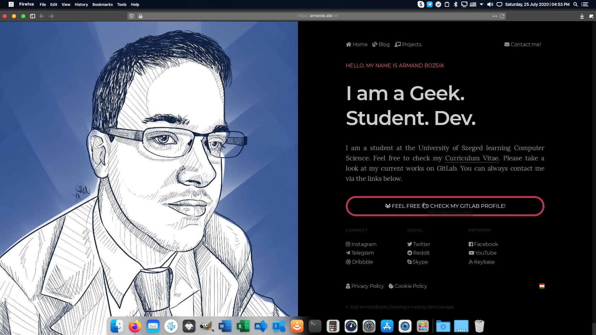

# My Safari-styled userChrome.css

My userChrome.css is based on the works noted in [COPYRIGHT.md](COPYRIGHT.md) (and is subject to further modification) to provide the most streamlined experience possible amd integration with [vinceliuice](https://github.com/vinceliuice)'s [WhiteSur](https://github.com/vinceliuice/WhiteSur-kde) theme. 

Base theme: [Safari Adaptive Dark](https://addons.mozilla.org/en-US/firefox/addon/safari-adapt-dark/)

I hope it will help someone one day. :) 

## Installation

Please take a look at the [documentation](https://www.userchrome.org/how-create-userchrome-css.html).

### TL;DR

Just copy the __chrome__ folder to your profile folder!

## Take a look

